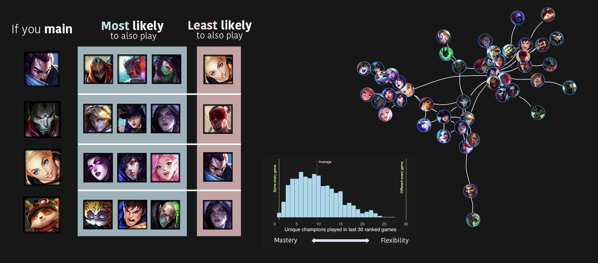
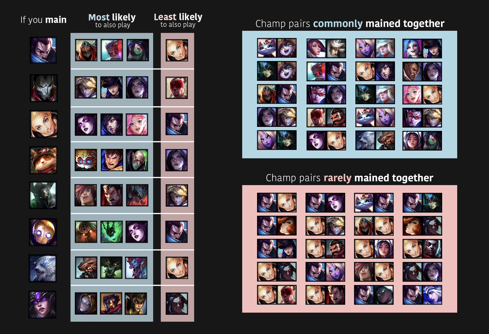
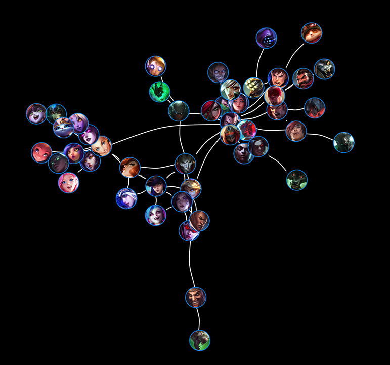
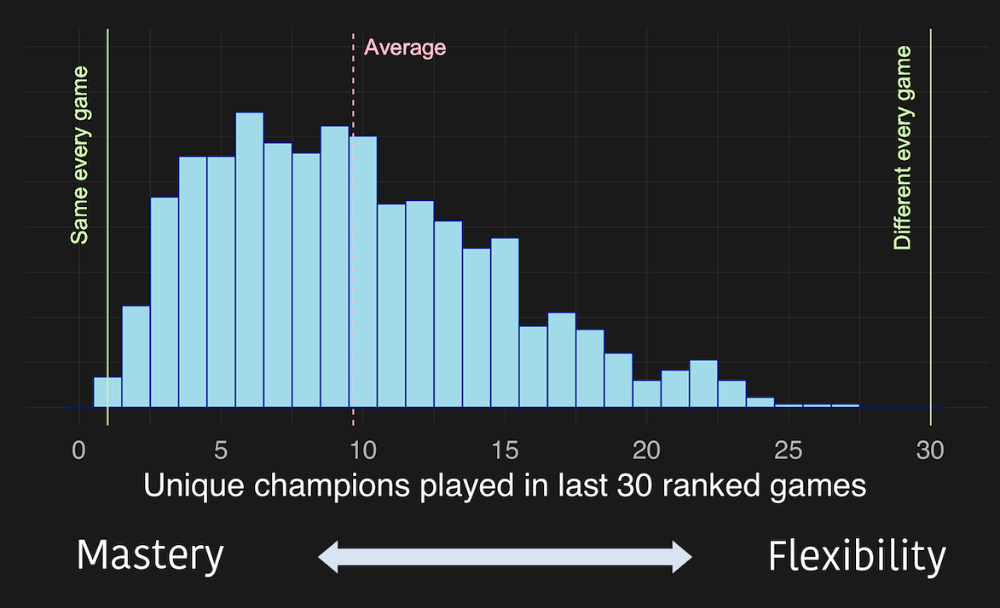

# League of Legends: Exploring patterns across players in champion preferences

[League of Legends](https://www.leagueoflegends.com/) offers a lot of choice in terms of playstyle and versatility, which is one reason why I think the game is so much fun. I have also always found it interesting how players seem to naturally fall into preferring certain roles and characters (champions). I was curious if I could <strong> extract and visualize some of these player patterns in a data-driven way. </strong> Do certain players prefer certain kinds of champions? Are there patterns in the types of champions that players main? For example, if you play Lux are you also likely to play Morgana? 

## What I did
1. Curated champion mastery and recent match data from [Riot Games API](https://developer.riotgames.com/) for thousands of players (ranging from Iron to Diamond)
2. Wrangled and analyzed data in R using descriptive statistics, correlation metrics, clustering, and network analyses
3. Visualized insights with R (ggplot2, igraph, magick) using champion icons and a bit of manual placement in illustrator/photoshop

Below I summarize some of the main findings.

## Preferences in champion mains
I selected the top 3 most mastered champions (mains) for each of the 14343 summoners in the dataset I curated. I then examined how often certain champions co-occured (were correlated) as mains across players. That is, for each champion I got a number for how often that champion was mained with all other champions across all players in the dataset. I then could examine which champions most frequently co-occured with maining another champion.

I chose 8 champs to visualize some of these insights (left). This shows if you play Yasuo you are likely to also play Zed, Yone, Akali, but not Lux. Not all champions had super strong correlations with other champions. So I also visualized (right) the champion pairs that had the strongest and weakest correlations. For example, being a Yuumi main very often co-occured with being a Lulu main. But a Yasuo main were unlikely to be a Lux main.

 

## Visualizing champion mains as a network
Another way to visualize this data is as a network, which can represent complex patterns by indicating relationship between items (in this case champions). Below I visualized champions that had strong connections with other champions (were often mained together). Connections indicate a strong relationship between those champions (those champions were frequently mained together). Because the network nodes (circles) are force-directed, the distance between champions also reflects how often those champions are to be mained together. You can see how groups of champions seem to emerge from this mastery data which is reflecting champion playstyles (e.g. assassins cluster, support cluster, ADC cluster). You can also see some interesting connections between these clusters. For example, champions with pulls (Thresh/Blitz/Pyke) are frequently mained together, but Pyke (due to being an assassin) has more direct connections with the assassin cluster. 

## How many different champions do summoners play?
I was also interested in how many champions people play overall (i.e. how small or big their champion pool is). As a preliminary analysis, I examined how many unique champions were played in the 30 most recent ranked matches for 1063 summoners. You can see that there is a pretty wide range in how many champions people play, but most summoners play around 5-10 unique champions (at least in their 30 most recent ranked games). There were at least a few players who played the same champion every game (one-tricks).

## Where to find stuff
- My code chunks I used to request data from Riot API can be found [here](/riot_api_fetch). Code is heavily based on this helpful [tutorial](https://rpubs.com/WallabyKingdom/riot-api) and modified to curate the data I needed
- Curated data from Riot API can be found in the folders: [mastery_data](/mastery_data) and [match_data](/match_data)
- Analysis scripts can be found in [mastery_analysis.Rmd](/mastery_analysis.Rmd) and [match_analysis.Rmd](/match_analysis.Rmd). RMarkdown-generated output (including additional visualizations) can be found in the respective .html files or viewed here: ([mastery](https://htmlpreview.github.io/?https://github.com/marlietandoc/lol/blob/main/mastery_analysis.html), [match](https://htmlpreview.github.io/?https://github.com/marlietandoc/lol/blob/main/match_analysis.html))

## Next steps
- Due to API rate limiting, I didn't get as much data as I would have liked. I'm hoping to retrieve more over time. For example, it would be neat to track player data across an entire ranked season. Or with more data, to see how the results change in different ranks (e.g. Bronze vs. Diamond)
- I have been interpreting the findings in terms of playstyle. But there might also be patterns in what champions people like to play for other reasons too, like choosing champions based on the current meta, difficulty, aesthetics, skins, and lore. For example, Teemo is most related to Heimer, Garen, and Singed, though their exact playstyle to me is not super similar (I guess turrets are like mushrooms, and Singed and Teemo have poison), but I also find all these champions kind of hilarious and fun.
- This project was a fun endeavor to visualize player preferences in champions. It could be the start of a champion recommender, or be combined with other data to generate additional insights into player preferences, playstyle, and behavior. With more data, I would be interested in seeing if we can use techniques to place players into groups (kmeans clustering, factor analysis, etc.) and then see if we can actually predict meaningful outcomes and player decisions (e.g. such as what certain groups of players might think of a new champion or meta).

