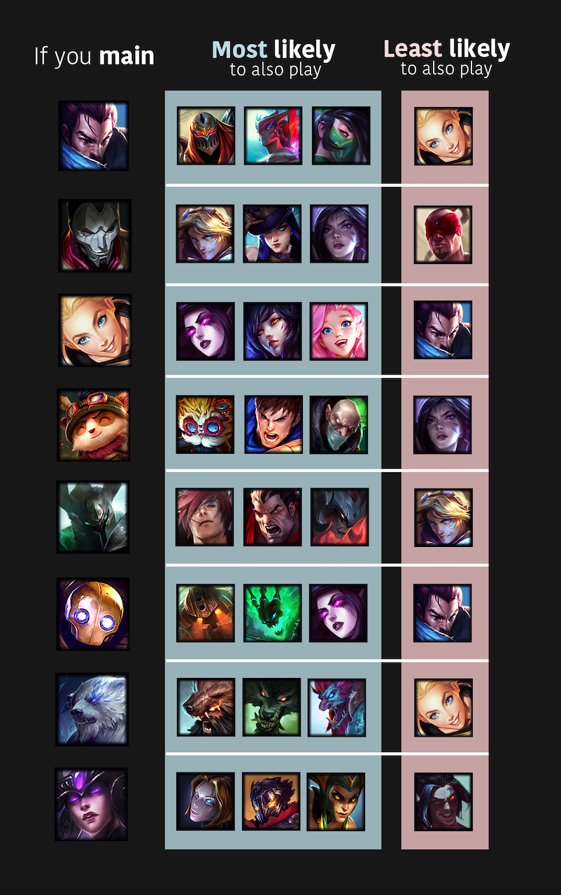

# League of Legends: Patterns across players in champion preferences

League offers a lot of choice in terms of playstyle, which is one reason why the game is so much fun. I have also always found it interesting how players seem to naturally "fall into" liking certain roles and champions. I was curious if I could extract some of these preferences in a data-driven way (by looking at what champions summoners play and master). Do players prefer certain kinds of champions? Are there patterns in what kinds of champs players tend to main? For example, if you play Lux what other champs are you likely to play (or unlikely to play).

## What I did
1. Pulled match and mastery data from Riot API for thousands of summoners
2. Analyzed data in R using descriptive statistics, multivariate correlation metrics, clustering, and network analysis
3. Visualized insights with R (ggplot2, igraph, magick) using champion icons and a bit of manual placement in illustrator/photoshop.

## Visualization generated from mastery data of 14343 summoners
For each champion, I examined how correlated or uncorrelated champions were across summoners in their top 3 mastered champs. I chose 8 champs to visualize these insights:
 

## Network generated from mastery data of 14343 summoners
Connections indicate a strong relationship in how often those champions are mained together across players. You can see communities that emerge which seem to reflecting players who prefer champions with different playstyles and lanes (assassins, adcs from more pokey to more all-in). You can also see some neat connections between these communities, such as the "pull" champions Thresh/Blitz/Pyke. With Pyke having more direct connections with the assassin-y cluster.

## The number of different champions summoners play in their most recent ranked games.
Most summoners play around 5-10 unique champions. 

## Where to find stuff
- Curated data from Riot API can be found in the folders: mastery_data and match_data
- Analysis scripts can be found in the .Rmd files and output (including additional visualizations) in the respective .html files
- Scripts used to request data from Riot API can be found in API_request folder

## Next steps
- This could also be the start of a champion recommender, or be combined with other data to be used to generate additional insights into player preference and behavior. I am especially interested in seeing if we can use clustering techniques to place players into "clusters" to see if this predicts what champions they play but also other aspects of gameplay.  
- Due to rate limiting I didn't get as much data as I would have liked from the API. I'm hoping to pull more over time. For example, it would be super cool to track player data across an entire ranked season
