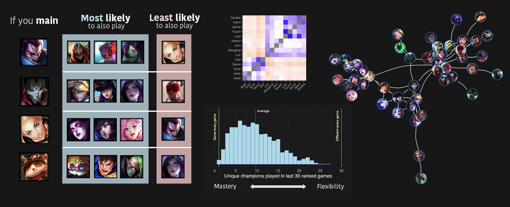

# League of Legends: Exploring patterns across players in champion preferences

[League of Legends](https://www.leagueoflegends.com/) offers a lot of choice in terms of playstyle, which is one reason why I think the game is so much fun. I have also always found it interesting how players seem to naturally "fall into" liking certain roles and champions. I was curious if I could extract some of these preferences in a data-driven way. Do players prefer certain kinds of champions? Are there patterns in the types of champions that players main? For example, if you play Lux are you also likely to play Morgana? 

## What I did
1. Pulled match and champion mastery data from [Riot Games API](https://developer.riotgames.com/) for thousands of summoners
2. Analyzed data in R using descriptive statistics, multivariate correlation metrics, clustering, and network analysis
3. Visualized insights with R (ggplot2, igraph, magick) using champion icons and a bit of manual placement in illustrator/photoshop

## Preferences in champion mains
I selected the top 3 most mastered champions (mains) for each of the 14343 summoners in the dataset. I then examined how often certain champions co-occured (were correlated) as mains across players. That is, for each champion I got a number for how often that champion was mained with all other champions. I chose 8 champs to visualize some of these insights (left). Not all champions had super strong correlations with other champions. So I also visualized (right) the champion pairs that had the strongest and weakest correlations (co-occured most frequently as mains). For example, being a Yuumi main is tightly linked to also being a Lulu main. But if you're a Yasuo main, you are unlikely to be a Lux main.

 

## Visualizing champion mains as a network
Another way to visualize this data is as a network. I visualized champions that had strong connections with other champions (were often mained together). Connections (white lines) indicate a strong relationship in how often champions are mained together. Because the network nodes (circles) are force-directed, the distance between champions indicate how often those champions are to be mained together. You can see communities that naturally emerge that seem to reflect champion playstyles (assassins cluster, support cluster, etc.). You can also see some neat connections between these communities such as the champions with pulls (Thresh/Blitz/Pyke) being frequently mained together. But with Pyke having more direct connections with the assassin cluster.

## How many different champions do summoners play?
I was also interested simply in how many champions people play (how small or big their champion pool is). As a preliminary analysis, I examined how many unique champions were played in the 30 most recent ranked matches for 1063 summoners. You can see that there is a pretty big range in how wide or narrow players champ pools are, but most summoners play around 5-10 unique champions (at least in their 30 most recent ranked games).

## Where to find stuff
- Curated data from Riot API can be found in the folders: mastery_data and match_data
- Analysis scripts can be found in the .Rmd files and output (including additional visualizations) in the respective .html files
- Scripts used to request data from Riot API can be found in API_request folder

## Next steps
- Due to rate limiting I didn't get as much data as I would have liked from the API. I'm hoping to pull more over time. For example, it would be super cool to track player data across an entire ranked season.
- For the most part, this project has been data-driven. I have been interpreting the findings in terms of playstyle. But there might also be patterns in what champions people like to play for other reasons too, like choosing champions based on the current meta, difficulty, aesthetics, skins, and lore. For example, Teemo is most related to Heimer, Garen, and Singed, though their exact playstyle to me is not super similar (I guess turrets are like mushrooms, and Singed and Teemo have poison), but I also find all these champions kind of hilarious (perhaps a little troll).
- This data also could be the start of a champion recommender, or be combined with other data to be used to generate additional insights into player preference and behavior. I am especially interested in seeing if we can use techniques to place players into groups (clustering, factor analysis, etc) to see if this predicts what champions they play but also other aspects of gameplay.

